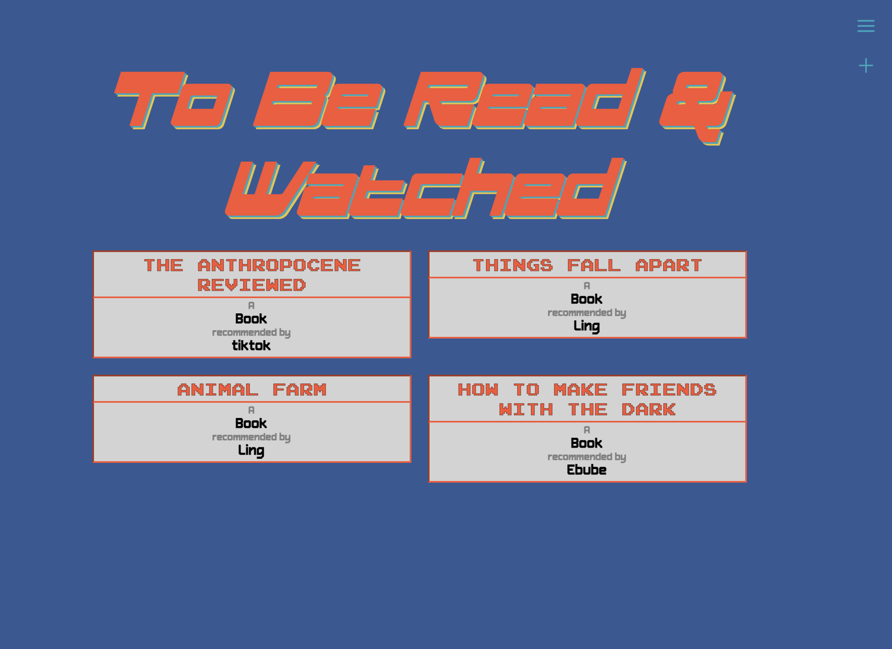

# By A Thread

## By Sharon Ogbonna
A Full Stack (MERN) Application with CRUD functionality. This project was inspired by [Notion](https://www.notion.so/), an organizational app. I named it By A Thread because sometimes you feel like that all that is holding your life together and that is okay. Hopefully this app can help with that. This repo works best with [this backend repo](https://github.com/Sharonogbonna/project3-backend). This app has size responsive styling - a big focus of mine - and a '90s' arcade design and color scheme.

#### Desktop Dashboard View

#### Mobile Dashboard View

## Live Links
####  Disclaimer: This application is deployed on the free tier of Render and may take a few minutes to wake up the server to load the data. When completely loaded it will look like the screenshot above.
- [By A Thread UI](https://byathread-ui.onrender.com/)
- [By A Thread Backend](https://byathread-api.onrender.com/)

## Other Features 

In this application you can create, edit, and display items for each category. Below are a collection of screenshot that show what this can look like for the different categories.

#### Display Menu to Navigate to Other Pages 

#### Display of all items on the To Be Read/Watched List 

#### Book Log Form

#### Individual Book Log 

#### Individual Grocery Item

## Access

You can fork and or clone the repo by copy and pasting the following in your terminal. Do not forget to install the dependencies displayed below.

`https://github.com/Sharonogbonna/project3-frontend`

## Technologies Used

- HTML
- JavaScript
- CSS
> MERN Stack
- MongoDb
- Mongoose
- Express
- React
- Node
- Axios
- Render Web Hosting Services

## Unsolved Issues

- Need to redo submit buttons for consistency, to either say edit, create, or all to say submit

## Future Enhancements

One goal is to make a user login so that you can only see the information that you add. Another goal is to make some edits to the dashboard so it's not as stagnant.  Along with this, I would like to add a weather and music section to the dashboard as well.
